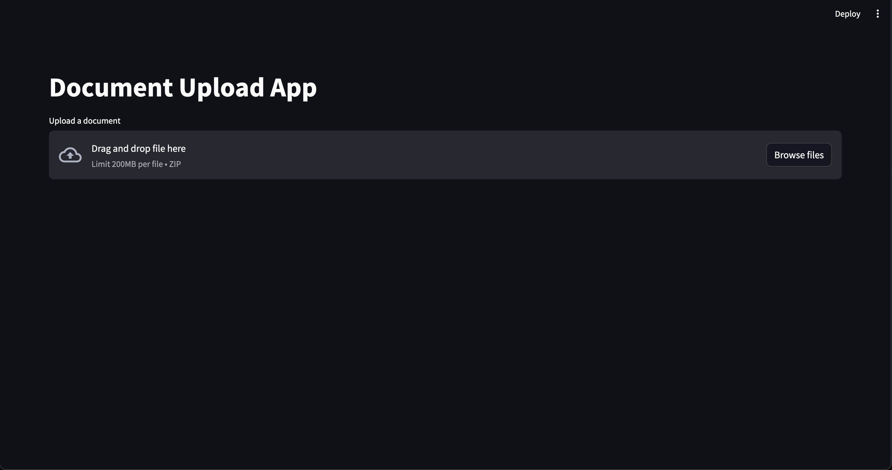
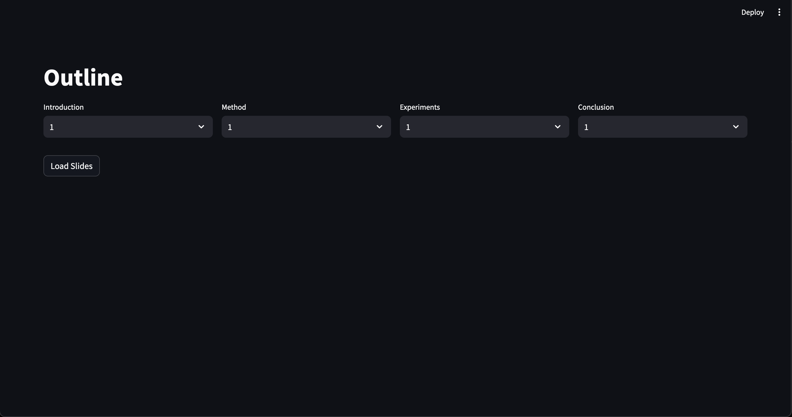
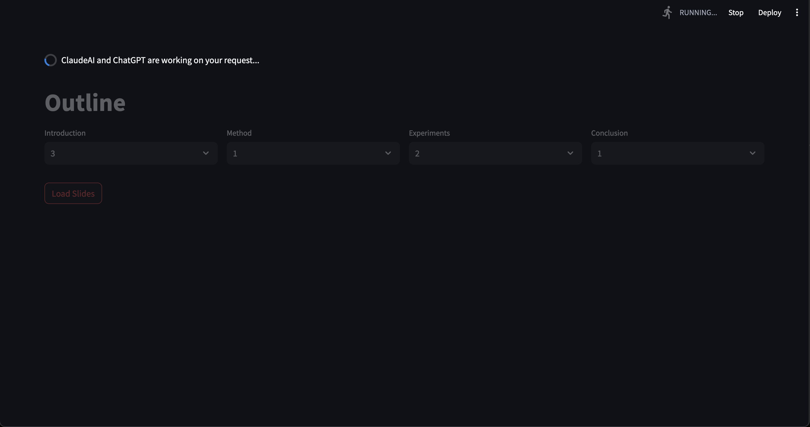
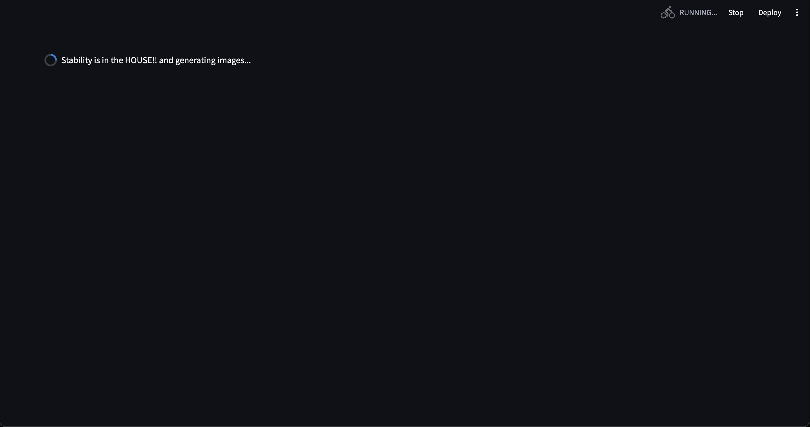
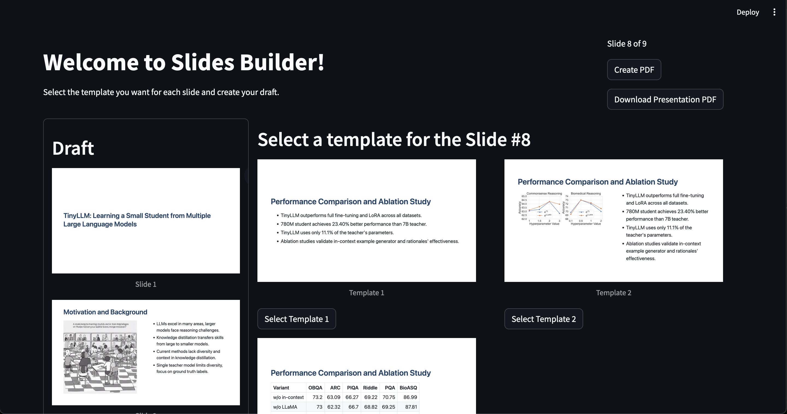

# slidify.ai

In this repository, we create a human-in-the-loop pipeline to generate a first draft of the presentation for any academic paper.

## Install the environment

We provide a Dockerfile to install all the relevant dependencies. To build the Docker image, run the following command:

```bash
docker build -t slidify .
```

## Run the Streamlit app

Once the image 

```bash
STABILITY_KEY=<KEY> OPENAI_API_KEY=<KEY> ANTHROPIC_API_KEY=<KEY> streamlit run streamlit_app.py
```

## Screenshots

### Upload the paper

We currently expect a zip file containing the latex files used to generate the paper. Further we expect that the primary `tex` file is named as `main.tex`.



### Provide preferences on how much slides need per section

We provide a selectbox to the user to select the number of slides they want per section.



### Extract the story to be presented based on preference

We extract the story to be presented based on the user preferences. Each section is divided in slides based on the user preferences. ChatGPT and OpenAI come to the rescue here.



### Adding fire and fun to the presentation

We add images to the presentation to make it more engaging. When a relevant image is available in the uploaded zip we use that, else we use the Stability.ai API to get the relevant image.



### Construct the presentation

Now based on your preferences and the extracted story, we construct the presentation for you. For each slide we provide a few choice of templates and you can select the one you like.

