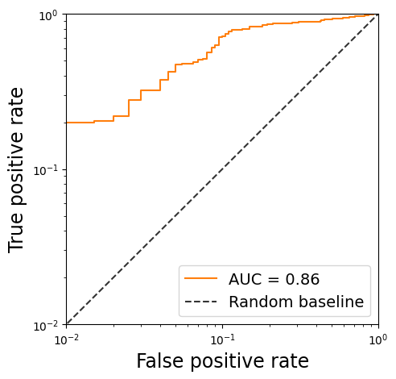
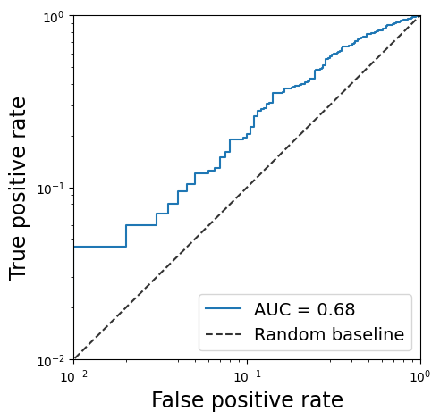
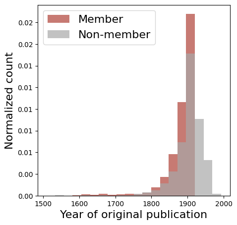
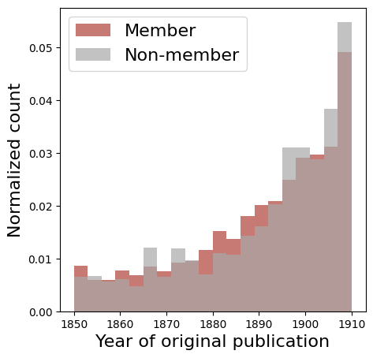
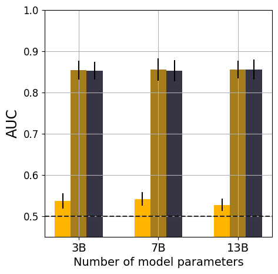
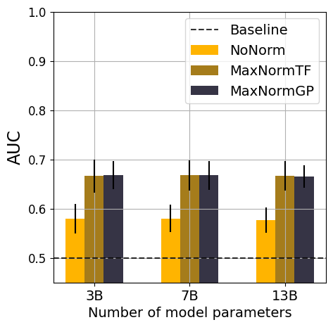

# Introduction

<figure id="fig:AUC_primary">

 

<figcaption>ROC curve for the best performing membership classifier (see
Tables <a href="#tab:books_primary" data-reference-type="ref"
data-reference="tab:books_primary">[tab:books_primary]</a> and <a
href="#tab:arxiv_primary" data-reference-type="ref"
data-reference="tab:arxiv_primary">[tab:arxiv_primary]</a> for details).
Results for books from Project Gutenberg (left) and academic papers from
ArXiv (right).</figcaption>
</figure>

Over the last year, Large Language Models (LLMs) have become ubiquitous.
By understanding and producing coherent natural language, models such as
GPT-2/3/4 [@radford2019language; @brown2020language; @gpt4techreport],
BLOOM [@scao2022bloom] and LLaMA
1/2 [@touvron2023llama; @touvron2023llama2], promise to revolutionise
society. ChatGPT, a fine-tuned version of GPT-3, was the fastest
consumer-focused application in history to reach 100 million
users [@chatgptfastest]. Since this breakthrough, investment in
Artificial Intelligence (AI) is estimated to reach \$200 billion
globally by 2025 [@aiinvestmentforecast].

While these models undoubtedly represent a major technical achievement,
their capabilities stem from having been trained on enormous amounts of
human-generated texts. For instance, Meta's first generation model,
LLaMA, had reportedly been trained for \"next-token-prediction\" on as
many as 1.4 trillion tokens [@touvron2023llama]. The capabilities of
these models furthermore seem, at least at the moment, to keep improving
with the size of the model (up to 100+ billion
parameters) [@bender2021dangers; @kaplan2020scaling]. This--in
turn--fuels the need for increasingly more data, even leaving some
wondering whether they might soon have consumed all the available data
on the internet [@villalobos2022will].

As LLMs become increasingly embedded into our daily life, simplifying
tasks, generating value, but also making decisions, questions are being
raised regarding the data from which their capabilities emerge. This
includes questions about what they will learn, e.g. whether modern
models will learn the societal biases present in the data or amplify
them [@sheng2019woman; @nadeem2020stereoset; @abid2021persistent] or
whether they might learn and propagate
disinformation [@zhang2023siren; @bloombergminformation; @barnard2023self; @nytimeschatgptdisinformation].
Additionally, it also raises questions on ownership of the knowledge
extracted by LLMs and whether copyright or *fair use*
apply [@samuelson2023generative]. Indeed, content creators have raised
concerns and filed lawsuits claiming copyright infringement by models
trained on the Books3 dataset, which would contain pirated copies of
their content [@silvermanmeta; @authorsguild].

Unfortunately, as those questions are being asked, model developers are
becoming increasingly reluctant to disclose and discuss their training
data sources. One of the currently most widely used models, GPT-4,
releases no information on its training dataset [@gpt4techreport], while
Meta initially released details on the training dataset of
LLaMA [@touvron2023llama], but now resists to do so in their release of
LLaMA-2 [@touvron2023llama2].

**Contribution.** We here introduce the concept of document-level
membership inference and propose what is -to the best of our knowledge-
the first setup and methodology to infer whether a large language model
has seen a document during training or not. Our method can help
organizations, regulators, content creators and model users to evaluate
whether a piece of content has been included in the training dataset of
an LLM.

First, we formalize the task of document-level membership inference and
propose a procedure and dataset for the development and the evaluation
of document-level membership inference methodologies. The development of
a meta-classifier, requires a dataset with *members*, documents that
were likely seen by the model during training, and *non-members*,
documents that are unlikely to have been seen by the model. Finding
members is typically easy as most LLMs today have seen sources such as
Common Crawl [@commoncrawl] or Project Gutenberg [@projectgutenberg].
Given the large amount of data seen by LLMs today, finding *non-members*
is more challenging. We thus propose to use documents similar to the one
available in public sources but now made available after the LLM was
released. We then construct a dataset to train and validate our
inference methodology for books (Project Gutenberg [@projectgutenberg])
and academic papers (ArXiv) and for OpenLLaMA [@openlm2023openllama],
whose training dataset is known,
RedPajama-Data [@together2023redpajama].

Next, we introduce our methodology to infer, based on black-box access
to the language model, whether a given document has been seen by a model
or not. The methodology consist of the following steps: querying the
model for token-level predictions, normalizing the predictions for how
common the token is, aggregating the predictions to the document level,
and lastly building a meta-classifier.

Our approach achieves an AUC of 0.856 and 0.678 for books and ArXiv
papers respectively, on average. We also find that for this setup we
retrieve a 64.4% and 19.5% true positive rate at a 10% false positive
rate, for books and papers respectively, implying that our classifier
can accurately identify members. Given the immense corpus used to train
a state-of-the-art LLM such as OpenLLaMA [@openlm2023openllama], we find
it remarkable that our auditor can distinguish the contribution of an
individual document. Our results also show that normalizing by both how
common a token is and by the maximum probability returned by the model,
is essential and that the signal for document-level membership lies in
the detailed distribution of the token-level information within a
document.

We then implement a sentence-level membership inference approach, such
as previously considered in the privacy
literature [@yeom2018privacy; @mattern2023membership; @carlini2021extracting].
We show this to perform poorly on our document-level membership
inference task, reaching an AUC of 0.52 for both books and ArXiv papers.

Finally, we investigate whether smaller models would impact the ability
of an auditor to infer document membership. We find that even the
smallest OpenLLaMA model, with 3 billion parameters, memorizes enough
information about specific documents for the inference to be successful.
In fact, our results show that the AUC remains at 0.86 and 0.68 for
books and ArXiv papers respectively when switching from the 7B
parameters to the 3B parameters models, indicating that even \"smaller\"
models are at risk.

# Background

## Language modeling

In the last couple of years, large language models (LLMs) have dominated
the research in Natural Language Processing
(NLP) [@radford2019language; @brown2020language; @vaswani2017attention].
Being trained in a self-supervised way on a large set of human generated
text, these models are increasingly able to understand and generate
natural language.

These models require a tokenizer $T$ that discretizes a sequence of
textual characters to a sequence of $n$ tokens $\{t_1,\ldots,t_n\}$. A
token can be any sequence of characters that appear in language (e.g. a
single word, part of a word or a combination of words). There is a
finite number of tokens, and the collection of the tokens is referred to
as the vocabulary $\mathcal{V}$ with vocabulary size $V =|\mathcal{V}|$.

Given a sequence of $n$ tokens, \"foundation\" language models are
trained to optimize the probability for the model to generate a sequence
of tokens $\{t_1,\ldots,t_n\}$, i.e. $p(t_{1},\ldots,t_{n})$. More
specifically, auto-regressive language models like OpenAI's GPT-2 and
GPT-3 [@radford2019language; @brown2020language] are trained for
\"next-token prediction\", i.e. to predict the likelihood of the
next-token given the preceding tokens. These models have shown to
improve understanding and particularly generation of natural language.
They compute the probability of a sequence of tokens from a series of
conditional probabilities as:

$$\begin{aligned}
    p(t_{1},\ldots,t_{n}) = \prod_{i=1}^{n} p(t_i | t_1,\ldots,t_{i-1})
\end{aligned}$$

The preceding sequence of tokens used to predict the probability of the
next token is commonly referred to as the $\emph{context}$, consisting
of length $C = |\text{context}|$.

Language models use complex neural networks to estimate this probability
distribution, with a significant amount of parameters to be fit during
training (up to 100+ billion). We denote $\theta$ as the set of
parameters of the language model $\textit{LM}$. The predicted
probability of language model $\textit{LM}$ with parameters $\theta$ for
token $t_i$ and context of length $C$ can be formalized as follows:

$$\begin{aligned}
\textit{LM}_{\theta}(t_i | t_{i-C}, \ldots, t_{i-1})
\end{aligned}$$ []{#eq:pred_proba label="eq:pred_proba"}

The values for the parameters $\theta$ are optimized to maximize the
likelihood of the sequence of tokens in a large dataset
$\mathcal{D}_{\text{train}}$. $\mathcal{D}_{\text{train}}$ can for
instance include a book or a Wikipedia page and in practice contains up
to trillions of tokens. Here, let's denote the total number of tokens in
the training data as $N_\text{train}$. More formally, the model
parameters $\theta$ are determined to minimize the following loss
function:

$$\begin{aligned}
\mathcal{L}(\theta) = -\log \prod_{i=1}^{N_\text{train}} \textit{LM}_{\theta}(t_i | t_{i-C}, \ldots, t_{i-1})
\end{aligned}$$

Typically, language models have a maximum input or context length that
can be taken into account to predict the probability for the next token.
We denote the maximum context length as $C_{max}$.

In the past, recurrent neural networks (RNNs) were the standard choice
for the architecture of these language models. However, over recent
years, they have been replaced by attention-based
models [@vaswani2017attention], in particular the transformer-based
models, which now dominate the scene.

Since the release of ChatGPT, a fine-tuned version of GPT-3 optimized
for chat-like behaviour, the development of ever better language models
has further accelerated. Examples include Palm
1/2 [@chowdhery2022palm; @anil2023palm], BLOOM [@scao2022bloom], LLaMA
1/2 [@touvron2023llama; @touvron2023llama2] and Mistral
7B [@jiang2023mistral]. At the same time, newly developed models are
increasingly made publicly available on the open platform hosted by
Hugging Face, which also deploys a LLM leaderboard to track and compare
performances [^2].

## Datasets used for training

State-of-the-art language models consist of billions of parameters,
which are trained on large-scale
datasets [@bender2021dangers; @kaplan2020scaling] containing trillions
of tokens. Web-scraped data from the internet has long been the primary
source for these large-scale datasets. Data retrieved from the
frequently updated Common Crawl [@commoncrawl] has for instance been the
majority of the training data for GPT-3 [@brown2020language],
LLaMA [@touvron2023llama] and BLOOM [@scao2022bloom].

Controlling the quality of the language included from these sources is
however crucial. This led to the creation of curated datasets, such as
WebText (which only contains text scraped from links sufficiently
recognized on the social media platform Reddit, used for
GPT-2) [@radford2019language] and C4 [@raffel2020exploring] and the
inclusion of more moderated content such as from Wikipedia.

Technology companies and researchers are in competition to develop ever
better performing large language models. The search for textual data,
ideally of high quality, to be used to train the models is thus crucial.
Exactly for this purpose, the training datasets have often been extended
by other sources of high quality text, such as academic papers from
ArXiv [@lewkowycz2022solving] or books from Project
Gutenberg [@projectgutenberg]. The latter contains thousands of English
books, the majority of whose copyrights in the United States have
expired and are thus in the public domain.

With the same objective of releasing more high quality textual data, Goa
et al [@song2019auditing] released a 800GB dataset called the Pile
consisting of a diverse set of English text data. This includes the
Books3 dataset, consisting of around 200,000 books obtained from pirate
sources. Moreover, most of the books included in Books3 have been
published in the last 20 years and are thus not free of
copyright [@atlantic; @wired]. It is known that for instance
BloombergGPT [@wu2023bloomberggpt] and LLaMA [@touvron2023llama] have
been trained on Books3.

## Copyright and generative AI

Content creators, such as authors or artists, have raised concerns about
the inclusion of their work in the training data of generative AI,
including large language models but also multi-modal models such as
DALLE-2 [@ramesh2021zero] and Stable Diffusion [@rombach2022high]. These
concerns have led to multiple lawsuits against technology companies who
have acknowledged to have used copyrighted material to train their
models and without the consent of the creators.

For instance, Stability AI is currently defending against two lawsuits,
one filed by Getty Images [@gettystability] and a second filed as a
class action lawsuit by multiple creators [@classactionstability], both
of which argue the use of copyright-protected content to train Stable
Diffusion. Further, US comedian Sarah Silverman and other authors have
filed lawsuits against Meta [@silvermanmeta], claiming Meta has
infringed their copyrights by training LLaMA on pirated copies of their
content. The US Authors Guild also published an open letter, signed by
more than 15,000 authors, calling upon AI industry leaders to protect
their content [@authorsguild].

Notably, since these lawsuits and public concerns have emerged, the
original data source for the Books3 dataset has now been removed [^3]
and technology companies tend to not disclose details on the dataset
used to train the latest language models any
longer [@touvron2023llama2].

Recognizing these ongoing court cases,
Samuelson [@samuelson2023generative] articulates the challenges between
copyright laws and generative AI. In particular, they mention that the
court will need to decide whether the inclusion of in-copyright works in
the training data of AI models falls under *fair use*, in which case it
would not be copyright-protected.

While it is still uncertain how copyright applies to generative AI, it
is clear that content creators are concerned [@authorsguild] while the
technology will continue to evolve rapidly without necessarily taking
these concerns into
account [@metacounterargument; @openaicounterargument].

## Membership inference attacks

Homer et al. [@homer2008resolving] introduced Membership Inference
Attacks (MIAs) to study whether the presence of a certain target
individual can be inferred from a complex genomic DNA mixture. They used
statistical tests to distinguish between mixtures that include the
individual and mixtures including individuals randomly drawn from a
reference population. Since then, MIAs have been widely used as a
privacy attack against aggregate data releases, including for instance
location data [@pyrgelis2017knock] or survey data [@bauer2020towards].

Since then, in the privacy literature, MIAs have also been developed
against Machine Learning (ML)
models [@shokri2017membership; @truex2019demystifying; @feldman2020does; @carlini2022membership; @hu2022membership].
Given a certain record $D$, a ML model trained on dataset
$\mathcal{D}_{\text{train}}$, the attacker aims to infer whether the
particular record was part of $\mathcal{D}_{\text{train}}$ or not. In
many cases, the MIA setup makes additional assumptions on the access to
the training data distribution and the ML model available to the
attacker.

Shokri et al. [@shokri2017membership] is seen as a foundational
contribution in the field of MIAs against ML models. They assume the
attacker to have black-box access to the model, i.e. they can query the
model for predictions for a given input, and consider various
assumptions on access to the training data. In their approach, the
attacker uses the shadow modeling technique enabling them to learn a
decision boundary for membership through a meta-classifier. Our proposed
method also leverages a similar meta-classifier, inspired by the shadow
modeling technique, while adapting it to our auditing setup.

MIAs against ML models have since been extensively studied in subsequent
works and have become a common tool to assess what a ML model memorizes
and whether its release poses any privacy
risk [@hu2022membership; @carlini2022membership; @song2019auditing; @feldman2020does; @meeus2023achilles; @cretu2023re].

Importantly for this paper, MIAs have also been developed against
(large) language models, which we discuss in the related work
(Sec. [\[sec:related_work\]](#sec:related_work){reference-type="ref"
reference="sec:related_work"}).

# Auditing setup

We consider an auditor $\mathcal{A}$ that has access to a document $D$,
e.g. a book or a research article, and wants to check if $D$ was used to
train a language model $\textit{LM}$. Thus, if we assume $\textit{LM}$
is trained using dataset $\mathcal{D}_{\text{train}}$, then the auditor
wants to infer whether $D \in \mathcal{D}_{\text{train}}$ or not.

We define the document $D$ consisting of tokens $t_i$ such that
$i \in \{1,...,N\}$.

$$D = \{SOS, \text{t}_1,.., t_i, ..,\text{t}_N, EOS\}$$ where $SOS$ is
start-of-sequence token, and $EOS$ is end-of-sequence token. Any such
document $D$ is highly likely to consist of significantly more tokens
than the maximum context length of existing language models. Thus, we
further assume that $D$ consists of $N$ tokens, and $N > C_{max}$.

The language model $\textit{LM}$ uses a tokenizer $T$ with vocabulary
$\mathcal{V}$, and $|\mathcal{V}| = V$.

We further assume that the auditor $\mathcal{A}$ has:

1.  Query-only access to the language model $\textit{LM}$, such that
    they can query the model with a sequence of tokens $S$, and receive
    the probability output for all tokens $v$ in vocabulary
    $\mathcal{V}$. This is a realistic assumption as trained models like
    LLaMA-2 [@touvron2023llama2] and Mistral 7B [@jiang2023mistral] are
    fully and freely released on platforms such as the one hosted by
    Hugging Face.

2.  Access to two sets of documents, that stem from the same
    distribution as the document $D$ e.g. if $D$ is a book then
    $D_{\text{M}}$ and $D_{\text{NM}}$ also contain books.
    $D_{\text{M}}$ and $D_{\text{NM}}$ are defined as follows:

    1.  $D_{\text{M}}$: A small subset of documents used in training of
        $\textit{LM}$, also referred to as members of the training set,
        $\forall D \in D_{\text{M}}, D \in \mathcal{D}_{\text{train}}$

    2.  $D_{\text{NM}}$: A small subset of documents not used in
        training of $\textit{LM}$, also referred to as non-members of
        the training set, i.e.
        $\forall D \in D_{\text{NM}}, D \notin \mathcal{D}_{\text{train}}$

Note that access to $D_{\text{M}}$ and $D_{\text{NM}}$ is realistic in
practice. First, most models use very similar datasets from sources such
as Common Crawl [@commoncrawl] and Project
Gutenberg [@projectgutenberg], that are publicly available in an
accessible format to be used to construct $D_{\text{M}}$. Secondly,
these sources are regularly updated and timestamped, which allows the
auditor to construct $D_{\text{NM}}$ by collecting the data that has
been added after the training data has been collected (for which
reasonable assumptions can be made as the model release is typically
known). We leverage exactly this intuition to build the dataset for our
experiments (see
Sec. [5.2](#sec:dataset_membership){reference-type="ref"
reference="sec:dataset_membership"}).

Under these assumptions, the auditor now aims to infer whether document
$D$ has been used to train the language model $\textit{LM}$. To achieve
this, the auditor $\mathcal{A}$ will construct a meta-classifier
$\mathcal{M}$ that predicts membership for any document $D$.
[]{#sec:auditor_model label="sec:auditor_model"}

# Methodology

The auditor $\mathcal{A}$ wants to build a meta-classifier $\mathcal{M}$
that could detect whether document $D$ was used to train the language
model $\textit{LM}$. To achieve this goal, we extract document-level
features for document $D$ that could carry meaningful information on the
membership of documents for the training of $\textit{LM}$.

**Intuition.** From the privacy literature on membership inference
attacks against machine learning
models [@shokri2017membership; @feldman2020does; @yeom2018privacy], we
learn that models tend to make more confident predictions on data
samples that were seen during training than on data samples that were
not. It is exactly this information that an auditor can leverage to make
an accurate prediction for membership. For language models, this
confidence is reflected in the predicted probability for the true next
token in the dataset given the preceding tokens. We use this intuition
to construct the document-level features, which are then used as input
for our meta-classifier $\mathcal{M}$.

We construct the membership inference using the following 4 steps:

1.  We first query $\textit{LM}$ to retrieve the predicted probability
    $\textit{LM}(t_i | t_{i-C}, \ldots, t_{i-1})$ of a token given the
    context of length $C$, and we do this for all tokens in document
    $D$, i.e. $\forall t_i \in D$. We try different values of $C$ in our
    approach.

2.  We then normalize the predicted probability of a token using a
    normalization algorithm $\textsc{Normalize}$. We define several
    different algorithms for $\textsc{Normalize}$ in
    Section [4.2](#sec:normalization){reference-type="ref"
    reference="sec:normalization"}.

3.  We then consider multiple strategies $\textsc{FeatAgg}$ to aggregate
    all the token level information for a document $D$ to construct
    document level features.

4.  Finally, the meta-classifier $\mathcal{M}$ takes as input the
    document-level features of $D$ to make a binary prediction on
    membership of $D$.

We further formalize these four steps in the sections below.

## Querying the model {#sec:query_model}

The auditor queries $\textit{LM}$ to retrieve a value per token $t_i$ in
document $D$. As the maximum context length of the model $C_{max}$ is
likely to be smaller than the length of the document $N$, the auditor
runs the model through the document with a certain fixed context length
$C$ and stride $s$.

The document is split in $N_s$ sequences $S_j, j = 1,...,N_s$ with
$S_j = (t_{j,1}, \ldots, t_{j,C})$ consisting of $C$ consecutive tokens
in $D$. The last sequence has $C'$ tokens, which can be $\leq C$
depending on the total number of tokens $N$ in $D$ and stride $s$. We
still use the same operations for this last sequence, but instead of $C$
we use $C'$.

Each sequence is passed to the model as input and results in a sequence
of predicted probabilities for the corresponding true tokens:

$$\begin{aligned}
\begin{split}
\textit{LM}_{\theta}(S_j) = & \left\{\textit{LM}_{\theta}(t_{j,2} | t_{j,1}),\ldots \textit{LM}_{\theta}(t_{j,C} | t_{j,1} \ldots t_{j,C-1}) \right\}
\end{split}
\end{aligned}$$

Note that $|\textit{LM}_{\theta}(S_j)| = |S_j| - 1 = C -1$, as the model
does not return a prediction for the first token $t_{j,1}$ in the
absence of a meaningful context to do so. Thus, when using context
length $C$, we move through the document with stride $s = C-1$. We then
get sequences $S_j$ for $j = 1 \ldots{N_s}$ where
$N_s = \lceil\frac{N}{C-1}\rceil$, so the resulting set of all
$\textit{LM}_{\theta}(S_j)$ contains predictions for all tokens in the
original document $t_i$, except for the very first token $t_1$. For rest
of the document, we refer to this probability of token $t_i$ in document
$D$ for language model $\textit{LM}_{\theta}$ simply as
$\textit{LM}(t_i)$.

The value for $C$ is a fundamental hyperparameter of the setup and can
be chosen to be any integer value smaller than $C_{max}$. Note that the
predictions of a language model typically become more accurate for a
longer context length $C$. However, as the goal is to retrieve
information that should be meaningful for membership, it is not clear if
this information is more likely to be at predictions with smaller or
larger context.

## Normalization ($\textsc{Normalize}$) {#sec:normalization}

In the section above, we query $\textit{LM}$ to extract
$\textit{LM}(t_i)$, i.e. the probability with which the $\textit{LM}$
would predict the next token in question given a certain context.
However, in natural language, some tokens are more rare than others.
Intuitively, the probability with which a model predicts a certain token
would depend on how rare such a token is. For instance, for a frequently
occurring token such as *the* or *and* the model might predict a high
probability, while for a more infrequent token the model naturally
predicts a lower probability. We hypothesize that this occurs regardless
of whether the model has seen the sequence of interest at training time
or not.

Thus, to optimally retrieve the information meaningful for membership we
*normalize* the model output with a value that takes into account the
rarity of a token. Prior work on sentence-level membership inference has
approached this in various ways. For instance, Carlini et
al. [@carlini2021extracting] consider the zlib entropy of a sequence,
while Mattern et al. [@mattern2023membership] use the predicted
probability of a reference model. While zlib considers the entropy of a
sequence and does not provide token-specific information, the use of a
reference model requires using another model which also uses the exact
same tokenizer $T$ as $\textit{LM}$, which is often not available.
Instead, we propose different $\textsc{Normalize}$ strategies, providing
token-specific normalization approaches based on the data and the model
the auditor $\mathcal{A}$ already has access to.

### Computing a normalization dictionary {#sec:norm_dict}

We consider the token $t_i=v$ in document $D$ with $v$ the token value
part of the vocabulary $\mathcal{V}$, or $v \in \mathcal{V}$. We then
normalize the predicted probability of $t_i$, $\textit{LM}(t_i)$, using
a reference value $R(v)$. $R(v)$ is calculated for each token $v$ in
vocabulary $\mathcal{V}$ to capture the rarity of $v$. We propose two
ways of evaluating $R(v)$.

#### **Token frequency (TF).**

Recall that the auditor is assumed to have access to both $D_{\text{M}}$
and $D_{\text{NM}}$. With the concatenated dataset as reference
$D_{\text{ref}} = D_{\text{M}} \cup D_{\text{NM}}$, the token frequency
${R^{TF}(v)}$ for token $v$ in vocabulary $\mathcal{V}$ is then computed
as follows:

$$\begin{aligned}
{R^{TF}(v)} = \frac{\text{count}(v, D_\text{ref})} {\sum_{j=1}^{V} \text{count}(v_j,D_\text{ref})}
\end{aligned}$$

where $\text{count}(v, D_\text{ref})$ corresponds to the number of times
token $v$ appears in the set of documents $D_\text{ref}$. For tokens
that do not appear even once in our dataset $D_{\text{ref}}$ we use the
smallest frequency in the normalization dictionary divided by 2 as a
reference value.

#### **General probability (GP).**

While the token frequency quantifies how rare a certain token is in the
dataset, its computation does not take into account the specific context
with which the token appears. Also, when a token $v$ does not appear
even once in $D_\text{ref}$, no valid value for the frequency
${R^{TF}(v)}$ can be computed.

In order to address both concerns, we propose to compute the *general
probability* $R^{GP}(v)$ of the token $v$ in vocabulary $\mathcal{V}$.
Here, we run through $D_\text{ref}$ as described in
Sec. [4.1](#sec:query_model){reference-type="ref"
reference="sec:query_model"} and compute the average of all the
predicted probabilities for $v$. Note that we consider all predictions,
also when the true token $t_k \in D_\text{ref}$ is not equal to $v$, as
the model predicts the probability distribution over the entire
vocabulary every time. $R^{GP}(v)$ is computed as follows:

$$\begin{aligned}
R^{GP}(v) = \frac{1}{|D_\text{ref}|} \sum_{k=1}^{|D_\text{ref}|} \textit{LM}_{\theta}(v \mid t_{k-C}, \ldots, t_{k-1})
\end{aligned}$$

### Normalization strategies

We here propose different normalization strategies $\textsc{Normalize}$
for $\textit{LM}(t_i=v)$ using $R(v)$, such that
$\textsc{Normalize}(\textit{LM}(t_i))=p_{\text{n}}(t_i)$.

#### **No normalization (*NoNorm*).**

In this case we use the predicted probabilities as they are and do not
apply any normalization, or:

$$\begin{aligned}
    \textit{NoNorm}(t_i=v) = & \textit{LM}(t_i)
\end{aligned}$$

#### **Ratio normalization using the token frequency (*RatioNormTF*).**

We here compute the ratio of the predicted probability of the token of
interest and the corresponding token frequency $R^{TF}(v)$ in
$D_\text{ref}$ as discussed in Sec.
[4.2.1](#sec:norm_dict){reference-type="ref" reference="sec:norm_dict"}.

$$\begin{aligned}
\textit{RatioNormTF}(t_i=v) =  \frac{\textit{LM}(t_i)}{R^{TF}(v)}
\end{aligned}$$

#### **Ratio normalization using the general probability (*RatioNormGP*).**

We here compute the ratio of the predicted probability of the token of
interest and the corresponding general probability $R^{GP}(v)$ in
$D_\text{ref}$ as discussed in Sec.
[4.2.1](#sec:norm_dict){reference-type="ref" reference="sec:norm_dict"}.

$$\begin{aligned}
\textit{RatioNormGP}(t_i=v) =  \frac{\textit{LM}(t_i)}{R^{GP}(v)}
\end{aligned}$$

#### **Maximum probability normalization (*MaxNorm*).**

For a given token $t_i$, the model predicts the probability distribution
over all tokens in the vocabulary $\mathcal{V}$. For now we have only
considered the probability that the model returns for the true token
$t_i$, regardless of how this probability compares to the predicted
probability for the other token values with the same context.
Intuitively, we could expect that the difference between the maximum
predicted probability over all tokens $t \in \mathcal{V}$ and the
predicted probability for the true token $t_i$ carries information about
how likely the model is to predict the token of interest. We thus
hypothesize that exactly this difference could be meaningful to infer
membership.

Formally, we denote the maximum probability being predicted for $t_i$
for context $C_i$ as

$$\textit{LM}_{\text{max}}(t_i|C_i) = \max_{t \in \mathcal{V}}\textit{LM}(t|C_i)$$

regardless of whether the probability corresponds to the true token
$t_i$ or not. For rest of the paper, $\textit{LM}_{\text{max}}(t_i)$
implies $\textit{LM}_{\text{max}}(t_i|C_i)$. We then combine this with
the ratio normalization strategies to get $\textit{MaxNormTF}$ and
$\textit{MaxNormGP}$.

$$\textit{MaxNormTF}(t_i=v) = \frac{ 1 - (\textit{LM}_{\text{max}}(t_i) - \textit{LM}(t_i))}{R^{TF}(v)}$$

$$\textit{MaxNormGP}(t_i=v) = \frac{ 1 - (\textit{LM}_{\text{max}}(t_i) - \textit{LM}(t_i))}{R^{GP}(v)}$$

Note that we ensure that the numerator never equals zero, even when the
model predicts the highest probability for the true token $t_i$, or when
$\textit{LM}_{\text{max}}(t_i) =\textit{LM}(t_i)$.

## Document-level feature extraction ($\textsc{FeatAgg}$)

For all the tokens $t_i$ in document $D$, we have so far normalized the
predicted probabilities using normalization strategy
$\textsc{Normalize}$. We now use these normalized values to set $F(t_i)$
as the negative log of the output after normalizing token-level
probabilities. So for normalization strategy $\textsc{Normalize}$:

$$F(t_i)=-\log(\textsc{Normalize}(\textit{LM}(t_i)))$$

Note that when we do not apply any normalization, or *NoNorm*, the value
for $F(t_i)$ corresponds to the cross-entropy loss for the predicted
probability, as used to optimize the model parameters during training.

While we now have computed a final value on the token level, our
ultimate goal remains to predict binary membership on the level of a
document. Hence, from all token-level information
$F(t_i), \forall t_i \in D$, we need to extract document-level features
that could capture meaningful information for a membership classifier.

We consider two feature extractors *AggFE* and *HistFE* that reduce the
token-level features to create document-level features.

#### **Aggregate feature extractor (*AggFE*).**

For each document $D$, *AggFE* computes high-level aggregate statistics
from the token-level information. Specifically, it uses
$F(t_i), \forall t_i \in D$ to compute:

-   the minimum value over all token-level features,

-   the maximum value over all token-level features,

-   the mean ($\mu$) value of all token-level features,

-   then standard deviation when considering all token-level features,
    and

-   the values at $x$-percentiles for $x \in X_\text{perc}$.

#### **Histogram feature extractor (*HistFE*).**

*HistFE* uses $N_b$ equal-sized histogram bins and for each document it
computes the fraction of total values $F(t_i)$ in each bin. These $N_b$
features are then used as document-level features. The $N_b$ equal-sized
bins are determined using all token-level values in the training
dataset, across all documents.

## Meta-classifier

As a final step, the document-level features extracted using
$\textsc{FeatAgg}$ are used as input to the meta-classifier
$\mathcal{M}$. $\mathcal{M}$ returns a prediction for binary membership
of input document $D$. For $\mathcal{M}$ we only consider a random
forest classifier for binary prediction, allowing to fit non-linear
dependencies across input features. We train $\mathcal{M}$ on a training
subset of $D_{\text{M}}$ and $D_{\text{NM}}$ and evaluate its
performance for binary classification on a disjoint subset.
[]{#sec:methodology label="sec:methodology"}

# Experimental setup

In this section, we describe the model $\textit{LM}$ and datasets
$D_{\text{M}}$ and $D_{\text{NM}}$ that we use to evaluate our
methodology.

## Model

As language model $\textit{LM}$ we here use the OpenLLaMA model
[@openlm2023openllama], a fully open-source reproduction of
LLaMA [@touvron2023llama], an auto-regressive large language model
developed by Meta AI. While LLaMA is made publicly available for
research and details on their training data have been provided in their
paper [@touvron2023llama], the exact training dataset has not been made
publicly available. Instead, OpenLLaMA is trained on RedPajama-Data,
which is a best-guess replication of the original dataset used to train
LLaMA [@together2023redpajama]. We opt for OpenLLaMA in our experimental
setup in order to be in full control of the training dataset.

The models are publicly available hosted by Hugging Face in three sizes:
3 billion, 7 billion and 13 billion parameters. The original data is
also publicly released along with the code to replicate the data
collection and preprocessing [@together2023redpajama]. The tokenizer $T$
has a vocabulary of size $V = 32,000$ and the maximum input length
equals $C_{max}= 2048$.

## Dataset for membership {#sec:dataset_membership}

We use two distinct types of documents, books and academic papers in
LaTeX, to evaluate the effectiveness of our methods in inferring the
document-level membership. For each type, we collect a fixed number of
member ($D_{\text{M}}$) and non-member ($D_{\text{NM}}$) documents. We
train a separate meta-classifier for each document type.

As indicated in
Sec. [\[sec:auditor_model\]](#sec:auditor_model){reference-type="ref"
reference="sec:auditor_model"}, we use realistic assumptions for the
auditor to collect both $D_{\text{M}}$ and $D_{\text{NM}}$ for each
document type. Specifically, for the member documents, we use data
sources that are typically used for language modeling and are readily
available. For non-members, we leverage the fact that these sources are
regularly updated to retrieve the documents that have been added after
the time the training data has been collected. While we believe these
assumptions are reasonable in practice, we additionally ensure there is
no overlap by using our exact knowledge of
RedPajama-Data [@together2023redpajama]. Below we describe in detail how
we approach this for each document type.

### Books (Project Gutenberg)

Project Gutenberg [@projectgutenberg] is a volunteering project aiming
to digitize and freely distribute books. The resulting online library
contains thousands of books from a wide range of languages and
publication dates. The vast majority of the releases are in the public
domain in the United States, meaning that copyright laws do not apply.

#### **Members $D_{\text{M}}$**.

We note that the RedPajama-Data includes both books from Project
Gutenberg and the Books3 dataset made available by the
Pile [@gao2020pile]. We exclusively consider the set of books PG-19 made
available by Rae et al. [@rae2019compressive]. This dataset contains
28,752 English books that were published before 1919 and made available
on Project Gutenberg.

#### **Non-members $D_{\text{DM}}$**.

Project Gutenberg is an ongoing project with new books being added on a
regular basis. We create a comparable book dataset that has not been
used for training by downloading books added to Project Gutenberg after
the PG-19 dataset was created. Of all books included in PG-19, the
latest release date on the Gutenberg project was February 10, 2019. We
then use an open source library [@kpullygutenberg] to download all
English books that were added to Project Gutenberg after this date. In
our setup, this led to a total of 9,542 books that we could use as
non-members. In line with how PG-19 has been constructed, we only
consider the text between the explicit start and end of the uniformly
formatted text files.

Two books published in different eras could be easily distinguished from
the writing style. In that regard,
Fig. [2](#fig:book_dates){reference-type="ref"
reference="fig:book_dates"} shows that there is a meaningful shift in
year of original publication between books considered as member and
non-members. Thus, there is a possibility that language written in books
from for instance the 1700s can lead to data drift compared to books
written in the 1900s. To ensure the meta-classifier $\mathcal{M}$
exclusively focuses on the memorization of the model, and does not focus
on a potential drift in language, we only consider books with a year of
original publication between 1850 and 1910.
Fig. [2](#fig:book_dates){reference-type="ref"
reference="fig:book_dates"} shows that the distributions of members and
non-members for these now filtered books are highly similar. This makes
us confident that the model would focus on the membership rather than on
the language drift.

<figure id="fig:book_dates">

 

<figcaption>Density distribution of the original year of publication for
books included in Project Gutenberg, for members and non-members. Both
the raw distribution (left) and the filtered distribution for years
1850-1910 (right) are displayed.</figcaption>
</figure>

### Academic papers (ArXiv)

We use academic papers as posted on the online research-sharing platform
ArXiv. In line with prior work training language models on academic
papers [@lewkowycz2022solving], RedPajama-Data includes the raw LaTeX
text after removing the bibliography, the comments and everything before
the occurrence of the first section.

#### **Members $D_{\text{M}}$.**

As RedPajama-Data includes the preprocessed LaTeX text from ArXiv
papers, we download documents that were part of the training dataset
using their instructions [^4]. This leads to approximately 1.5 million
ArXiv papers to be considered as members of the training dataset.

#### **Non-members $D_{\text{NM}}$.**

The Github repository of RedPajama-Data [@together2023redpajama] also
provides instructions on how to download academic papers from ArXiv
directly. ArXiv maintainers host an Amazon S3 bucket containing all
source LaTeX files, which gets updated on a monthly basis and can be
retrieved at a moderate charge [^5]. The data is grouped by the month on
which the first version of the document has been added to ArXiv. From
RedPajama-Data, we found that the last month that had been included in
the training dataset was February 2023, which allows us to download all
academic papers uploaded on ArXiv from March 2023 and use them as
non-members. After applying the same preprocessing recipe as for the
members, our non-member dataset of ArXiv paper eventually consists of
around 155 thousand documents.

### Training and evaluation setup {#sec:data_split}

We use the documents considered as members and non-members to train and
validate our method to predict membership of document $D$ in the
training data. To ensure our model focuses on documents of a reasonable
length, and sufficiently longer than the maximum context length,
$C_{max}$, we remove all documents, from both the books and academic
papers, that have fewer than 5,000 tokens. We then randomly sample 1,000
member and 1,000 non-member documents. Next, we construct $k=5$
different chunks of $400$ documents, each chunk consisting of $200$
member documents and $200$ non-member documents. This allows us to train
our set-up using $k-1$ chunks, i.e. $1600$ documents, and validate the
performance on the held-out chunk, i.e. on $400$ documents. By executing
this $k$ times, the classification performance is robustly estimated
with a mean and standard deviation across $k$ runs. For both document
types, books and academic papers, we construct this setup to train and
evaluate a distinct meta-classifier $\mathcal{M}$ $k$ times.

### Methodology parameters {#sec:meth_params}

We here describe the values for the parameters listed in our methodology
(Sec. [\[sec:methodology\]](#sec:methodology){reference-type="ref"
reference="sec:methodology"}) used in the experiments.

1.  For context length $C$ used in querying the model, we evaluate for
    three different values$\{128, 1024,2048\}$, the last of which is
    same as the maximum context length $C_{max}$.

2.  As $D_\text{ref}$ to compute the normalization dictionaries in
    $\textsc{Normalize}$, we use the same sets of documents used to
    train the meta-classifier. This means that $k-1 = 4$ chunks, with a
    total $800$ members and $800$ non-members are used, leading to
    $|D_\text{ref}| = 1,600$ for every run.

3.  For the feature extractor *AggFE* we use a set of percentiles
    $X_\text{perc} = \{1, 5, 10, 25, 50, 75, 90, 95, 99\}$. For feature
    extractor *HistFE*, we use number of bins $N_b = 1,000$.

4.  For the meta-classifier $\mathcal{M}$ we use a random forest
    classifier from scikit-learn [@scikit-learn] with 500 trees of a
    maximum depth of 5 and a minimum of samples per leaf of 3.

We ran all language model queries on a set of A100 NVIDIA GPUs with a
floating point precision of 16 bits.

# Results

We here present the performance of our meta-classifier $\mathcal{M}$ for
detecting membership of a document as part of the training dataset of
$\textit{LM}$. All the results are computed and aggregated over $k=5$
runs as described in
Section [5.2.3](#sec:data_split){reference-type="ref"
reference="sec:data_split"}.

## Evaluation across setups and datasets {#sec:results_primary}

Tables [\[tab:books_primary\]](#tab:books_primary){reference-type="ref"
reference="tab:books_primary"}
and [\[tab:arxiv_primary\]](#tab:arxiv_primary){reference-type="ref"
reference="tab:arxiv_primary"} summarize the performance of our binary
membership classifier for books from Project Gutenberg and ArXiv papers
respectively. We measure the performance of $\mathcal{M}$ using the Area
Under the Receiver Operating Characteristic Curve (AUC-ROC) and report
the mean and standard deviation over $k=5$ runs.

The highest mean AUC achieved across setups for books and papers is
$0.856$ and $0.678$ respectively, which is significantly higher than the
random baseline of $0.5$. This effectively shows that our model queries,
normalization strategies and feature extraction enables the
meta-classifier to learn the decision boundary for membership of a
document $D$ in the training data of an LLM. Around 250,000 books and
1.5 million ArXiv papers contribute to around 4.5% and 2.5% of the
entire training dataset [@touvron2023llama]. This makes the contribution
of one document to the entire dataset negligible, and highlights the
difficulty of membership inference. In this context, our
meta-classifier's performance demonstrates the ability of our simple
$\textsc{Normalize}$ and $\textsc{FeatAgg}$ strategies to separate
signal from the noise.

Further, the results allow us to compare the combinations of different
setups, i.e. combination of context length $C$, normalization strategy
$\textsc{Normalize}$, and feature aggregation strategy
$\textsc{FeatAgg}$ as discussed in
Sec. [\[sec:methodology\]](#sec:methodology){reference-type="ref"
reference="sec:methodology"}. First, we notice fairly little difference
in performance across different values of context length $C$. This would
imply that memorization is equally exposed for lower and larger values
of context length. Second, we find that normalization is required to
reach reasonable classification performances. Compared to the raw
predicted probabilities *NoNorm*, all normalization strategies lead to
an improved performance. Notably for *MaxNormTF*, we find that, for
$C=128$ and *HistFE*, the mean AUC increases by $0.29$ and $0.10$ for
books and papers respectively when compared with *NoNorm* performance.
Additionally, we find fairly little difference between normalizing with
the *token frequency* $R^{TF}(v)$ or *general probability* $R^{GP}(v)$
across setups. This would imply that both normalization dictionaries
provide similar information on the rarity of a token value. Third, we
find that the histogram feature extraction *HistFE* is significantly
more effective than the more simple aggregate statistics extraction
*AggFE*. For *MaxNormTF* and $C=128$, *HistFE* leads to an increase in
AUC of $0.24$ and $0.05$ for books and papers respectively compared with
*AggFE* in an equivalent setup. This makes us confident that the
information for membership truly lies in the detailed distribution of
token-level values per document, rather than in high-level aggregates.
Overall, $C=128$, normalization using *MaxNormTF*, and feature
aggregation using *HistFE* results in the best performing
meta-classifier $\mathcal{M}$ for both books and academic papers.

Fig. [1](#fig:AUC_primary){reference-type="ref"
reference="fig:AUC_primary"} shows the ROC curve for one trained
meta-classifier $\mathcal{M}$, randomly selected out of the $k$, for the
setup resulting in the best performing meta-classifier $\mathcal{M}$. In
line with Carlini et al. [@carlini2022membership], we also provide the
true positive rate at low false positive rates for this setup in
Table [1](#tab:tpr_fpr){reference-type="ref" reference="tab:tpr_fpr"}.
Especially for the books, a true positive rate of $18.75\%$ at a false
positive rate of $1\%$ implies a meta-classifier $\mathcal{M}$ that can
confidently identify members in a given set of documents.

::: {#tab:tpr_fpr}
  ------------------- ------------------ ------------------
                           TPR@FPR       
        Dataset              10%                 1%
   Project Gutenberg   $64.44 \pm 9.32$   $18.75 \pm 3.82$
       2-3 ArXiv       $19.50 \pm 0.94$   $5.92 \pm 2.13$
  ------------------- ------------------ ------------------

  : True positive rates at low false positive rates for the best setup
  in
  Tables [\[tab:books_primary\]](#tab:books_primary){reference-type="ref"
  reference="tab:books_primary"}
  and [\[tab:arxiv_primary\]](#tab:arxiv_primary){reference-type="ref"
  reference="tab:arxiv_primary"} (in percentages).
:::

::: table*
  -------------------- ---------------------- -------------------- -------------------- -------------------
                                               Context length $C$                       
   $\textsc{FeatAgg}$  $\textsc{Normalize}$           128                  1024                2048
        *AggFE*        *NoNorm*                $0.550 \pm 0.011$    $0.551 \pm 0.009$    $0.554 \pm 0.012$
          2-5          *RatioNormTF*           $0.605 \pm 0.025$    $0.552 \pm 0.017$    $0.556 \pm 0.012$
          2-5          *RatioNormGP*           $0.621 \pm 0.031$    $0.539 \pm 0.022$    $0.553 \pm 0.021$
          2-5          *MaxNormTF*             $0.620 \pm 0.029$    $0.546 \pm 0.021$    $0.543 \pm 0.016$
          2-5          *MaxNormGP*             $0.626 \pm 0.025$    $0.542 \pm 0.025$    $0.553 \pm 0.021$
        *HistFE*       *NoNorm*                $0.566 \pm 0.022$    $0.528 \pm 0.024$    $0.541 \pm 0.017$
          2-5          *RatioNormTF*           $0.766 \pm 0.030$    $0.786 \pm 0.028$    $0.799 \pm 0.020$
          2-5          *RatioNormGP*           $0.779 \pm 0.010$    $0.790 \pm 0.013$    $0.804 \pm 0.011$
          2-5          *MaxNormTF*                                  $0.854 \pm 0.026$    $0.855 \pm 0.027$
          2-5          *MaxNormGP*             $0.849 \pm 0.019$    $0.853 \pm 0.0218$   $0.852 \pm 0.026$
  -------------------- ---------------------- -------------------- -------------------- -------------------
:::

::: table*
  -------------------- ---------------------- -------------------- ------------------- -------------------
                                               Context length $C$                      
   $\textsc{FeatAgg}$  $\textsc{Normalize}$           128                 1024                2048
        *AggFE*        *NoNorm*                $0.617 \pm 0.015$    $0.605 \pm 0.031$   $0.602 \pm 0.022$
          2-5          *RatioNormTF*           $0.609 \pm 0.027$    $0.614 \pm 0.027$   $0.613 \pm 0.017$
          2-5          *RatioNormGP*           $0.605 \pm 0.028$    $0.609 \pm 0.019$   $0.616 \pm 0.014$
          2-5          *MaxNormTF*             $0.630 \pm 0.021$    $0.622 \pm 0.026$   $0.623 \pm 0.026$
          2-5          *MaxNormGP*             $0.635 \pm 0.016$    $0.632 \pm 0.022$   $0.626 \pm 0.023$
      2-5 *HistFE*     *NoNorm*                $0.579 \pm 0.029$    $0.580 \pm 0.026$   $0.580 \pm 0.028$
          2-5          *RatioNormTF*           $0.644 \pm 0.028$    $0.647 \pm 0.026$   $0.654 \pm 0.033$
          2-5          *RatioNormGP*           $0.643 \pm 0.031$    $0.638 \pm 0.026$   $0.645 \pm 0.030$
          2-5          *MaxNormTF*                                  $0.668 \pm 0.031$   $0.668 \pm 0.031$
          2-5          *MaxNormGP*             $0.675 \pm 0.019$    $0.665 \pm 0.021$   $0.668 \pm 0.029$
  -------------------- ---------------------- -------------------- ------------------- -------------------

[]{#tab:arxiv_primary label="tab:arxiv_primary"}
:::

## Comparison to sequence-level baseline {#sec:sequence_baseline}

In the privacy literature, prior work on Membership Inference Attacks
(MIAs) against language models has exclusively focused on inferring
membership at the sentence-level
 [@carlini2021extracting; @carlini2022membership; @mattern2023membership; @yeom2018privacy].

In contrast, our setup concerns an auditor who aims to infer
document-level membership. Our approach is focused on constructing
document-level features to be used as input for a meta-classifier.

We now consider whether the sentence-level MIA can be scaled to the
document-level. Specifically, we consider the following methodology:

1.  We split each document $D$ in sequences
    $S_j = (t_{j,1}, \ldots, t_{j,C})$ of the same length $C=128$ and
    consider these sequences as comparable to sentences. We found 1000
    tokens to approximately map to 750 words, and hence using $C=128$
    tokens is a good proxy for selecting a sentence. We then use the
    same label of membership for these sentences as used for the
    corresponding document $D$.

2.  For each sequence $S_j$, we compute the negative log of the
    predicted probability for the true token $t_{j,i}$ and consider an
    average across all tokens in the sequence, or:

    $$\begin{aligned}
            CE(S_j) = \frac{1}{C}\sum_{i=1}^{C} -\log \left(\textit{LM}(t_{j,i})\right) 
        
    \end{aligned}$$

    This corresponds to the cross-entropy loss computed for sequence
    $S_j$ as would be used to train the model $\textit{LM}$.

3.  In line with Yeom et al. [@yeom2018privacy] and the baseline used in
    Mattern et al. [@mattern2023membership], we predict positive
    membership of $S_j$ if this sequence-level loss $CE(S_j)$ is larger
    than a certain threshold $T$, i.e. $CE(S_j) \geq T$. We compute $T$
    as the value for which the maximum sum of the true positive and true
    negative rates is reached on the training dataset.

Considering the exact same setup as in
Sec. [6.1](#sec:results_primary){reference-type="ref"
reference="sec:results_primary"}, we compute the AUC for membership on
the sequence-level for $k$ chunks. Additionally, in order to compute a
document-level prediction, we take the ratio of sequences within a
document, i.e. $\forall (S_j) \in D$, that are predicted as member, as
the predicted probability for membership of document $D$. We then use
this predicted probability to evaluate the AUC for document-level
membership inference using sequence-level information.

Table [2](#tab:sentence_baseline){reference-type="ref"
reference="tab:sentence_baseline"} summarizes the results for this
sequence-level baseline, with the mean and standard deviation AUC for
both the sequence-level and the document-level predictions across both
datasets. We note the classification performance for both is barely
above the random baseline AUC of $0.5$.

::: {#tab:sentence_baseline}
        Dataset            Sequence            Document
  ------------------- ------------------- -------------------
   Project Gutenberg   $0.520 \pm 0.005$   $0.518 \pm 0.021$
       2-3 ArXiv       $0.512 \pm 0.009$   $0.501 \pm 0.012$

  : Mean and standard deviation AUC for the sequence-based baseline.
:::

First, these results show that sequence-level membership inference
attacks from the privacy literature might not work out-of-the-box for
language models trained on a significantly larger corpus than previously
considered [@carlini2022membership; @carlini2021extracting; @mattern2023membership].
Second, these results suggest that using sequence-level information to
predict document-level membership might not work. Indeed, the signal for
document membership might lie within the distribution of the token-level
predictions rather than in the sequence-level predictions.

## Evaluation across model sizes {#sec:model-size-evaluation}

Note that all results in the section above were achieved with the
OpenLLaMA model with 7 billion parameters (7B) [@openlm2023openllama].
We here evaluate whether our membership inference methodology would work
equally well for models with less parameters. We thus use $C=2048$ and
*HistFE* feature-aggregation strategy, against the model with 3B
parameters. We consider the two best performing normalization strategies
*MaxNormTF* and *MaxNormGP*, along with *NoNorm* for comparison.

Fig. [3](#fig:across_models){reference-type="ref"
reference="fig:across_models"} shows that the AUC for membership
classification remains highly consistent for even the smallest model.
This implies that the memorization, as measured by our meta-classifier,
for a \"smaller\" model of 3 billion parameters remains fairly similar.
While these findings contrast with prior
work [@carlini2022quantifying; @carlini2021extracting], which show that
memorization increases with model size, we note that our setup is
significantly different. First, we only compare across larger models
(3B+ parameters) and second, we measure memorization by evaluating
document-level inference, which is very different than the extraction of
specific sensitive information. Lastly, we also evaluate our setup using
the model with 13 billion parameters and find that, again, the
membership inference performance remains highly consistent.

<figure id="fig:across_models">

 

<figcaption>Mean AUC for context length <em>C</em> = 2048 across model sizes, for
books from Project Gutenberg (left) and ArXiv papers
(right).</figcaption>
</figure>

## Performance difference between datasets

The results in
Tables [\[tab:books_primary\]](#tab:books_primary){reference-type="ref"
reference="tab:books_primary"}
and [\[tab:arxiv_primary\]](#tab:arxiv_primary){reference-type="ref"
reference="tab:arxiv_primary"} show a significant difference between the
document-level membership inference performance on the books versus
academic papers, with the highest mean AUC across setups of $0.856$ and
$0.678$, respectively. We here discuss multiple hypotheses for this
difference.

First and foremost, the data itself is inherently different. The papers
from ArXiv consist of data from raw LaTeX files. This contains a highly
specific set of characters, e.g. LaTeX specific formatting, the content
of tables, and references to figures, while the natural language
included in books from the literature is expected to contain a wider
diversity of tokens also represented in the wider vocabulary of the
training dataset. Fig. [4](#fig:papersVSbooks){reference-type="ref"
reference="fig:papersVSbooks"} (a) compares how the token frequency
$R^{TF}$ is distributed across the top 20,000 tokens between papers and
books. This confirms our hypothesis that LaTeX papers contain more of a
limited set of tokens, while the tokens used in books are more widely
spread over the entire vocabulary $\mathcal{V}$, possibly affecting the
distribution of predicted probabilities that our method requires as
input.

Second, academic papers and books have a different length, i.e. total
number of tokens per document.
Fig. [4](#fig:papersVSbooks){reference-type="ref"
reference="fig:papersVSbooks"} (b) confirms that the books considered in
our experiments consist of significantly more tokens than the ArXiv
papers, with an average of approximately 112,000 and 19,000 tokens
respectively. This means that the language model $\textit{LM}$ has seen
more tokens from member-books than from member-papers. Moreover, books
typically contain repeated occurrences of characters, e.g. *Harry
Potter*, across the document. These characters would likely be rare
tokens, occurring more often for the longer books than for papers,
likely impacting the model memorization more for books than for papers.
We thus hypothesize that these rare tokens contain meaningful
information for document-level membership and thus impact our
classification performance. Additionally, the document length could also
play a role at inference time of the meta-classifier. Indeed, during
feature extraction, more rare tokens contribute to our final feature set
in the case of books than for papers, which again would impact the
classification performance.

<figure id="fig:papersVSbooks">

<figcaption>(a) Distribution of token frequency <em>R</em><em>T</em><em>F</em> for
the top 20,000 tokens. (b) Density distribution of number of tokens per
document. Both (a) and (b) contain results from for 2,000 ArXiv papers
and 2,000 books from Project Gutenberg.</figcaption>
</figure>

Third, we anticipate that books in Project Gutenberg often represent the
pieces of literature that are wide-spread across the internet. This
means that there might exist an overlap between the books as included in
the PG-19 dataset for training and the data scraped from the internet
such as Common Crawl [@commoncrawl] and C4 [@raffel2020exploring] which
are also included in the training of OpenLLaMA [@openlm2023openllama].
This leads to a potential level of duplication, which would be
reasonably more likely for books that have been added to Project
Gutenberg earlier than later (i.e. members). This will likely impact the
memorization of these books in the language model $\textit{LM}$. In
contrast, academic papers, especially in LaTeX, are rarely distributed
widely.

# Discussion

In this paper, we construct a novel setup for document-level membership
inference for real-world large language models.

First, we introduce a general paradigm to construct a labeled dataset
for document-level membership that we believe to be realistic in
practice. Indeed, large language models typically use similar data
sources to construct a training dataset, such as Common
Crawl [@commoncrawl], C4 [@raffel2020exploring] and Project
Gutenberg [@projectgutenberg]. This makes the identification of member
documents using our methodology fairly feasible in practice. Moreover,
these sources are typically continuously updated and timestamped, which
enables an auditor to retrieve similar sets of documents that were added
after the LLM training dataset was created. This allows the auditor to
easily construct comparable sets of non-member documents, i.e. the
documents that were not used during training.

Using this approach, we created a clean dataset of members and
non-members for the OpenLLaMA [@openlm2023openllama] language model. We
do this for both the books from Project Gutenberg and academic papers
from ArXiv. We create a clean setup to ensure that the meta-classifier
exclusively focuses on the memorization and not on the other potential
differences between members and non-members. We leave for future work
how the meta-classifier performance changes when certain assumptions are
relaxed. In particular, our setup could be applied to the original
LLaMA [@touvron2023llama] model instead of
OpenLLaMA [@openlm2023openllama] and potentially even on
LLaMA-2 [@touvron2023llama]. Additionally, we could further study how
the meta-classifier scales across specific datasets considered. For
instance, one meta-classifier could be trained and evaluated on data
containing both papers and books, or the meta-classifier could even be
applied to books from other sources, e.g. the Books3 dataset.

In Sec. [6.3](#sec:model-size-evaluation){reference-type="ref"
reference="sec:model-size-evaluation"} we demonstrate the effectiveness
of our method to language models of different model sizes (3B, 7B and
13B parameters) separately. In practice, it is however common that
multiple models, with an increasing number of parameters, are released.
Further, all of these models are generally trained on exactly the same
dataset. We hypothesize that the auditor could construct a
meta-classifier that takes as input document-level features queried from
models of different sizes to make a potentially more accurate prediction
for membership in practice.

In Sec. [\[sec:methodology\]](#sec:methodology){reference-type="ref"
reference="sec:methodology"} we propose a variety of methods to infer
membership. While highly effective, the most successful setup is still
rather simple. In particular, we consider normalization, feature
extraction and the classification as separate steps, while we could
imagine that a classifier with trainable feature extraction could be
built to optimally predict membership. We hope our setup sets a baseline
performance and anticipate that future work could build more complex and
ever more accurate classifiers.

Further, we constrained ourselves to use a dataset of members
$D_\text{M}$ and non-members $D_\text{NM}$ of size $1000$ each given the
resource constraints. With our computational resources, it takes us
approximately a day to generate the predicted probabilities for each
token in the books dataset by querying language model $\textit{LM}$. We
expect that researchers with a large resource pool could explore the
impact of having larger datasets of members and non-members on the
performance of the meta-classifier $\mathcal{M}$.

Lastly, with this successful proof-of-concept, we hope to provide a way
to retrieve a reasonable estimate of whether a document has been
included in the training dataset of a large language model. Not only
does this improve our understanding of memorization in ever larger
models in practice, it also encourages increased transparency in what
LLMs are trained on.

# Related work

There exists a significant literature focusing on privacy attacks
against (large) language models, which are relevant to our setup for
document-level membership inference.

Carlini et al. [@carlini2019secret] proposes a framework to
quantitatively asses unintended memorization in generative sequence
models, such as language models trained for next token prediction. They
effectively showcase how log-perplexity from a LSTM recurrent neural
network trained for next token prediction can be used to extract
potentially sensitive sequences from the training data (such as emails
or credit card information). Further, Song et al. [@song2019auditing]
proposes a method to audit text generation models. Specifically, they
use the shadow modeling technique to train a binary classifier for
membership of the training data. For text generation, they implement
this on the user level, aggregating predictions from individual pieces
of text associated with the same user. While conceptually this is
similar to document-level membership inference as in this paper, Song et
al. apply their approach on recurrent neural networks trained on small
datasets. Due to the computational cost to train a state-of-the-art,
real-world large language
model [@radford2019language; @brown2020language; @touvron2023llama; @touvron2023llama2; @jiang2023mistral],
the use of the shadow modeling technique is no longer feasible. Further,
the size of the dataset used to train these models [@bender2021dangers]
has drastically increased since then, making the contribution of an
individual document distinctly harder to distinguish. For both reasons,
new methods such as we here propose, are required to infer
document-level membership against the most recent models.

Subsequently to their prior work, Carlini et
al. [@carlini2021extracting] introduces a novel method for training data
extraction from the transformer-based GPT-2 language model, which has up
to 1.5 billion parameters and is trained on a vast training dataset of
40GB of text [@radford2019language]. Importantly for this project, they
show that a combination of perplexity queried from the model and zlib
entropy (which gives a certain reference notion of surprise for a
certain sequence of characters) allows for effective extraction of
training data. Additionally, they show that larger models, i.e. neural
networks with more parameters, tend to memorize more from their training
data. Mattern et al. [@mattern2023membership] proposes a neighborhood
attack for MIAs against language models. They also attack GPT-2,
although now fine-tuned on specific data for which membership is then
inferred. They use a similar data distribution as the data used for
fine-tuning to train a reference model, which they use for what we refer
to as normalization.

**In contrast with the prior contributions mentioned above, this paper
focuses on document-level membership inference for real-world, truly
large language models (7B+ parameters). This is, to the best of our
knowledge, the first work of its kind.**\
Further, researchers have proposed defenses against these privacy
attacks, such as de-duplication of the training
data [@kandpal2022deduplicating] or differentially private
training [@li2021large]. However, Lukas et al. [@lukas2023analyzing]
challenges this, stating that these defenses do not reduce the risk
posed to personal identifiable information. Lastly, various other works
have developed membership inference attacks on more domain as well as
task-specific language models, such as clinical language
models [@jagannatha2021membership] or language models in non-English
languages [@oh2023membership], or fine-tuned models for machine
translation [@hisamoto2020membership] or
classification [@shejwalkar2021membership; @shachor2023improved].

[]{#sec:related_work label="sec:related_work"}

# Conclusion

This paper proposes the first setup and methodology for document-level
membership inference for real-world, large language models (LLMs).

First, we formalize the task and introduce a procedure to realistically
construct a labeled training dataset. For non-members, we rely on
original documents that are similar to documents seen by the model but
made available after the release date of the model. We then construct a
dataset for the OpenLLaMA [@openlm2023openllama] model for both books
from Project Gutenberg [@projectgutenberg] and academic papers from
ArXiv.

We then propose a methodology to infer document-level membership. We
find that the distribution of predicted probabilities for all the tokens
within a document, normalized by a value reflecting the rarity of the
token, contains meaningful information for membership. Indeed, in the
best performing setup, the meta-classifier infers binary membership with
an AUC of 0.86 and 0.68 for books and papers respectively. Together with
a true positive rate of 64.4% for books and 19.5% for papers at a 10%
false positive rate, this suggests our classifier's ability to
accurately infer whether a document has been seen by the LLM during
training.

[^1]: Corresponding author: deMontjoye@imperial.ac.uk.

[^2]: <https://huggingface.co/spaces/HuggingFaceH4/open_llm_leaderboard>

[^3]: <https://huggingface.co/datasets/the_pile_books3>

[^4]: <https://huggingface.co/datasets/togethercomputer/RedPajama-Data-1T>

[^5]: <https://info.arxiv.org/help/bulk_data_s3.html>
