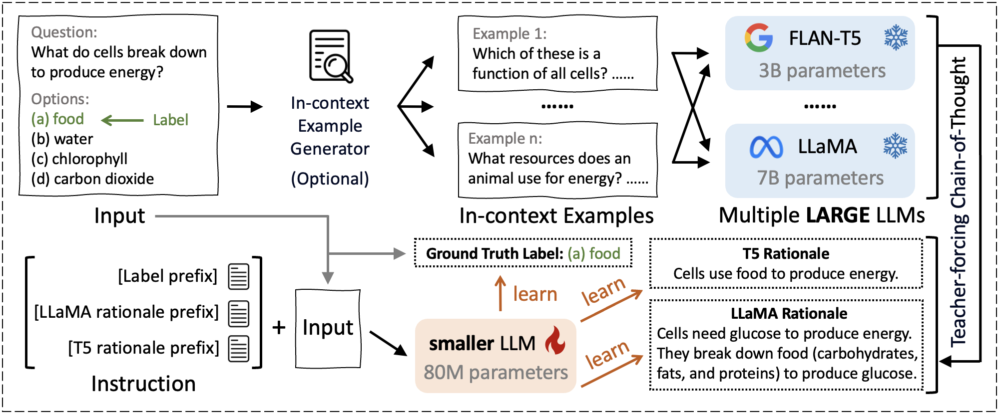

# Introduction

Large language models (LLMs) have recently taken over various domains
and applications, including society  [@rao2023makes],
education [@zelikman2023generating], and scientific
understanding [@beltagy2019scibert]. Despite the success of larger
emerging models (GPT-4, Claude-2), their smaller counterparts hardly
demonstrate such promising capabilities for performing complex
reasoning [@wei2022emergentabilities; @chen2023gotta]. This has been
unveiled as the well-known scaling law of LLMs [@kaplan2020scalinglaws].
As such, it has been desirable to transfer the capabilities of the
larger models to the smaller ones so that the smaller ones could be
easily deployed while still enjoying the strong capabilities. Previous
studies have shown that knowledge distillation is an instrumental tool
in mitigating the performance gap between larger models such as LLMs and
smaller
ones [@wan2023efficient; @hsieh-etal-2023-distilling; @kd_survey].
Examples of effective distillation methods include
DistilBERT [@sanh2019distilbert], Alpaca [@alpaca] and
Vicuna [@zheng2023judging].

However, existing methods suffer from two major drawbacks: (1) **Limited
Knowledge Diversity**: Current research predominantly employs a
single-teacher approach, which confines the learning scope of the
student model to the knowledge derived from its own training and
architecture designs
[@ho2022largelanguagemodels; @magister2022teachingsmall; @li2023symbolicchain; @wang2022pinto].
This means that the student model is limited to the perspectives,
biases, and potential weaknesses of the teacher. (2) **Lack of Rich
Contextual Information**: While rationales play a vital role in
effective reasoning [@wei2022chainofthought; @kojima2022zero], current
research primarily focuses on leveraging ground truth labels, which
indicate the correct answer but do not provide insights into the
reasoning and thought process behind that answer.

In response to the above issues, we propose [TinyLLM]{.smallcaps}, a
paradigm that improves the reasoning ability of small student LLMs by
distilling knowledge from multiple large teacher LLMs with rationale
guidance. Specifically, [TinyLLM]{.smallcaps} mitigates the limited
knowledge diversity issue by involving multiple teacher models as
*co-advisors*. To fully exploit each teacher model and mitigate the lack
of rich contextual information problem, [TinyLLM]{.smallcaps} asks the
teacher for the rationales to support the answers. By learning from
multiple teachers, the student model can inherit a broader range of
skills and knowledge, leading to better generalization capabilities. In
addition, to ensure the rationales are grounded in contextually
appropriate scenarios and reflect the true underlying reasoning
procedure, [TinyLLM]{.smallcaps} features an in-context example
generator and a teacher-forcing Chain-of-Thought strategy, making the
teachers understand the task through demonstrations and generate the
accurate rationales.

To thoroughly assess our approach, we conduct experiments on six
datasets in commonsense and biomedical reasoning tasks. The results show
that the usage of our paradigm enhances performance by **+5.07%** to
**+12.57%** compared to full fine-tuning with significantly smaller
model size, i.e., **1.1%** to **26.0%** of teacher sizes. We also
perform ablation studies to demonstrate the validity of teacher
rationales and undertake hyperparameter analyses for a comprehensive
evaluation. To summarize, our main contributions are as follows:

::: figure*
::: center
{width="\\textwidth"}
:::
:::

-   We identify two problems with existing work on learning smaller
    language models: 1) limited knowledge diversity and 2) lack of rich
    contextual information.

-   To address the problems, we propose [TinyLLM]{.smallcaps}, a novel
    knowledge distillation paradigm to learn a small student LLM by
    transferring reasoning capabilities from multiple large teacher
    LLMs. We encourage the student LLM to understand the rationale
    behind the generated answer.

-   Extensive experiments validate the superiority of
    [TinyLLM]{.smallcaps} across six datasets and two reasoning tasks.
    [TinyLLM]{.smallcaps} can achieve up to **+12.57%** of performance
    improvement with 1.1% of model size.

# Method

The pipeline of [TinyLLM]{.smallcaps} is shown in Figure
[\[fig:pipeline\]](#fig:pipeline){reference-type="ref"
reference="fig:pipeline"}.

## Preliminary

**Multiple Choice Question Answering.** A $k$-way multiple choice
question answering (MCQA) is defined as follows: Given a question $Q_i$,
a set of candidate answer options $O_i=\{O_{i1},O_{i2},...,O_{ik}\}$,
the model is tasked with selecting the correct answer from the set
$O_i$, such that the selected answer aligns the ground truth label
$A_i$.

**Knowledge Distillation.** The knowledge distillation process begins
with the teacher model, denoted as $T$ parameterized by $\theta_T$,
which has been pre-trained on a large corpus. Later, the student model,
$S$, with parameter $\theta_S$, is tasked with distilling knowledge
directly from $T$, leveraging the strong capabilities of $T$.

## Obtaining Rationales from Teachers

**In-context Example Generator.** To enable the rationales that are
generated by teachers to be grounded in contextually appropriate
scenarios, we introduce an optional in-context example generator. This
tool is designed to produce in-context examples for any given input,
providing more detailed information about the input data and task. For
simplicity, we select the examples randomly within the same dataset.
This aids the teacher LLMs in comprehending the nature and specifics of
the task more deeply. By integrating this generator, we facilitate a
more informed and nuanced generation of rationales by the teacher
models, enhancing the learning experience for the student model.

**Teacher-forcing Chain-of-Thought.** In addition, we design a
teacher-forcing strategy to ensure the validity of the rationales.
Compared to existing methods that simply employ regular chain-of-thought
(CoT) mechanisms [@wei2022chainofthought; @kojima2022zero], wherein an
LLM is prompted with sets of questions and options $\{Q_i, O_i\}$ to
elicit rationales $R_i$ directly, [TinyLLM]{.smallcaps} posits a
distinct advantage in integrating the correct answer $A_i$ into the
input. We hypothesize that the inclusion of $A_i$ alongside $Q_i$ and
$O_i$ facilitates a more nuanced understanding of the input context and
the correct logical rationales leading to the answer, thereby
facilitating a more informed and accurate generation process.
Specifically, we consider the concatenation of questions, options, and
answers $\{Q_i, O_i, A_i\}$ as the input to LLMs.

**Rationales from Multiple Teachers.** Given $M$ teachers,
[TinyLLM]{.smallcaps} pioneers the usage of a multi-teacher architecture
in which each teacher $T^m$ is an LLM. In particular, the rationale
$R_i^m$ produced by a specific teacher model $\theta_{T^m}$ for the
$i$th question is derived using the question $Q_i$, options $O_i$,
correct answer $A_i$, and in-context examples $P_i$. The process is
formalized as follows:
$$R_i^m = T^m(Q_i, O_i, A_i, P_i; \theta_{T^m}).$$

::: table*
[]{#Overall label="Overall"}

::: tabular
ccccccccc & & & &\
& & **OBQA** & **ARC** & **PIQA** & **Riddle** & **PQA** & **BioASQ** &\
& FLAN-T5 xlarge & 69.20 & 68.24 & 58.43 & 53.73 & 71.50 & 65.85 &
64.49\
& LLaMA 2 & 58.60 & 45.90 & 78.80 & 47.65 & 54.50 & 73.75 & 59.87\

& Inference & 16.60 & 19.31 & 20.78 & 13.33 & 38.00 & 47.97 & 26.00\
& LoRA & 37.80 & 27.12 & 39.93 & 39.80 & 53.75 & 78.05 & 46.08\
& Full Fine-tuning & 41.60 & 27.47 & 42.33 & 42.75 & 56.25 & 78.86 &
48.21\
& [TinyLLM]{.smallcaps} & **47.60** & **31.93** & **52.77** & **49.22**
& **62.00** & **82.11** & **54.27**\
& $\Delta_{FF}$ & $\uparrow 14.42\%$ & $\uparrow 16.24\%$ &
$\uparrow 24.66\%$ & $\uparrow 15.13\%$ & $\uparrow 10.22\%$ &
$\uparrow 4.12\%$ & $\uparrow 12.57\%$\

& Inference & 31.00 & 23.00 & 30.47 & 30.78 & 48.00 & 57.72 & 36.83\
& LoRA & 51.40 & 37.25 & 47.66 & 53.14 & 62.00 & 82.93 & 55.73\
& Full Fine-tuning & 56.60 & 38.88 & 47.55 & 52.55 & 64.75 & 89.43 &
58.29\
& [TinyLLM]{.smallcaps} & **64.20** & **47.98** & **60.17** & **60.78**
& **66.25** & **90.24** & **64.94**\
& $\Delta_{FF}$ & $\uparrow 13.43\%$ & $\uparrow 23.41\%$ &
$\uparrow 26.54\%$ & $\uparrow 15.66\%$ & $\uparrow 2.32\%$ &
$\uparrow 0.91\%$ & $\uparrow 11.40\%$\

& Inference & 50.40 & 51.07 & 51.90 & 39.80 & 64.25 & 63.41 & 53.47\
& LoRA & 64.00 & 57.77 & 57.02 & 68.63 & 70.25 & 86.18 & 67.31\
& Full Fine-tuning & 71.20 & 62.92 & 58.43 & 68.82 & 70.25 & 90.24 &
70.31\
& [TinyLLM]{.smallcaps} & **74.40** & **64.29** & **67.90** & **70.98**
& **73.00** & **92.68** & **73.88**\
& $\Delta_{FF}$ & $\uparrow 4.49\%$ & $\uparrow 2.18\%$ &
$\uparrow 16.21\%$ & $\uparrow 3.14\%$ & $\uparrow 3.91\%$ &
$\uparrow 2.70\%$ & $\uparrow 5.07\%$\
:::
:::

## Learning a Small Student

A straightforward strategy to incorporate rationales as supervision is
to append each rationale $R_i^m$ generated by the teacher models as
supplementary input to the student model, along with the question $Q_i$
and options $O_i$. However, this method faces challenges due to
limitations in computational resources at the inference stage,
especially because rationales must be pre-generated for every data
sample in both training and test sets [@wang2022pinto]. To overcome this
issue, we employ rationales as a form of supervisory signal during the
training process to develop a model that is adept at generating its own
explanations. Subsequently, this trained model can be utilized on the
test set, eliminating the need for pre-generated rationales to
facilitate accurate reasoning. Specifically, [TinyLLM]{.smallcaps}
integrates rationales from multiple teacher models into a unified
multi-task instruction tuning framework. This necessitates the
assignment of a unique prefix $p$ for distinguishing between learning
tasks from different teachers. The student model is trained not only to
predict labels but also to generate rationales akin to those produced by
the teachers. Accordingly, the overall loss function $\mathcal{L}$ is as
follows:
$$\mathcal{L} = \mathcal{L}_A + \sum_{m=1}^{M}\alpha^m\mathcal{L}_{T^m}, 
\label{eq:total_loss}$$ where $\mathcal{L}_A$ denotes the objective of
learning from ground truth answers, $\mathcal{L}_{T^m}$ indicates the
objective of learning from $m$-th teacher, $\alpha^m$ is the importance
weight for $T^m$, and $M$ is the number of teacher LLMs. Formally,
$\mathcal{L}_A$ and $\mathcal{L}_{T^m}$ are defined as follows:
$$\mathcal{L}_A = \frac{1}{N} \sum_{i=1}^{N} \ell(S(Q_i, O_i, p_A; \theta_S), A_i),$$
$$\mathcal{L}_{T^m} = \frac{1}{N} \sum_{i=1}^{N} \ell(S(Q_i, O_i, p_m; \theta_S), R_i^m),$$
where $N$ is the number of data samples, $\ell$ indicates the
cross-entropy loss between the predicted and target tokens. Here
$\mathcal{L}_A$ encourages the student $S$ to generate ground truth
answer $A_i$ by minimizing the difference between it and the student
output given the question $Q_i$, options $O_i$, and instruction prefix
$p_A$ for generating answers. On the other hand, $\mathcal{L}_T^m$
facilitates the student $S$ to mimic the reasoning capability of teacher
$T^m$ by learning from its rationale $R_i^m$, with the guidance of
instruction prefix $p_m$ for $T^m$.

# Experiments

## Experimental Setup

**Datasets.** We follow the setup in GNP [@gnp] for the usage of
commonsense reasoning and biomedical reasoning datasets, including
OpenBookQA (OBQA) [@OpenBookQA2018], The AI2 Reasoning Challenge
(ARC) [@Clark2018ThinkYH], Physical Interaction Question Answering
(PIQA) [@Bisk2020PIQA], RiddleSense
(Riddle) [@lin-etal-2021-riddlesense], PubMedQA
(PQA) [@jin2019pubmedqa], and BioASQ [@Tsatsaronis2015BIOASQ].

**Baselines.** We benchmark [TinyLLM]{.smallcaps} against the teacher's
performance and various training approaches, including an Inference
configuration without training, an efficient training method LoRA
[@hu2022lora] that updates a subset of parameters, and the full
fine-tuning that updates all the parameters in the student.

**Implementation Details.** For [TinyLLM]{.smallcaps}, we set the
learning rate to $5 \times 10^{-5}$, batch size to 16, maximum input
length to 1024, and epoch to 1. Trade-off weights $\alpha_{T_n}$ are
explored within {0.01, 0.1, 0.5, 1, 2, 3}. For the choice of LLMs, we
use FLAN-T5  [@chung2022scaling] small (80M), base (250M), and large
(780M) as the student, and FLAN-T5 xlarge (3B) and LLaMA 2-chat
 [@touvron2023llama2] (7B) as teachers. Experiments are conducted on
four NVIDIA Tesla H100 GPUs.

## Performance Comparison

**Comparison to Students Learning Methods.** The results of six datasets
and two reasoning tasks are shown in Table
 [\[Overall\]](#Overall){reference-type="ref" reference="Overall"}. From
the table, we observe that the employment of a full-finetuning method,
despite its theoretically enhanced capacity for parameter adjustment,
does not consistently yield superior results to LoRA. Conversely,
[TinyLLM]{.smallcaps} demonstrates substantial performance enhancements
across all datasets and LLM sizes. In total, [TinyLLM]{.smallcaps}
achieves an average enhancement of **+12.57%**, **+11.40%** and
**+5.07%** for students with 80M, 250M, and 780M parameters,
respectively. This validates the effectiveness of [TinyLLM]{.smallcaps}
and underscores the importance and benefits of learning from teachers.

**Comparison to Teachers.** [TinyLLM]{.smallcaps} also shows superior
performance compared to the teacher models. For example, a 780M student
can achieve an average performance of 73.88 across different datasets,
which is **+14.56%** better than the 3B teacher and **+23.40%** better
than the 7B teacher. Moreover, an even smaller student model with 250M
parameters can outperform the teachers (**+0.70%** to 3B, **+16.82%** to
7B) while using only **8.3%** and **3.6%** of the teacher parameters.

## Ablation Study

For a comprehensive evaluation, we conduct ablation studies to validate
the contribution of the in-context example generator and rationales from
multiple teachers. To facilitate this, we create three ablation variants
of [TinyLLM]{.smallcaps}.

-   **w/o in-context** rules out the in-context examples during
    rationale generation.

-   **w/o LLaMa** and **w/o T5** exclude the rationale supervision from
    the corresponding teacher model during distillation.

Table  [\[tab:results\]](#tab:results){reference-type="ref"
reference="tab:results"} depicts the comparison between the full
[TinyLLM]{.smallcaps} model and its ablations on the six datasets.
According to the table, the decreasing performances of removing the
in-context examples and teacher rationales demonstrate their
effectiveness in enhancing the model. By combining all the designs, the
proposed [TinyLLM]{.smallcaps} achieves the best performance. These
findings indicate that learning high-quality rationale signals from
multiple teachers is beneficial in distilling a small LLM with better
reasoning ability.

[]{#tab:results label="tab:results"}

## Parameter Sensitivity

The exploration of trade-off weights reveals the model's adaptability
across different choices of parameter values. We conduct sensitivity
experiments on datasets ARC for commonsense reasoning and PQA for
biomedical reasoning in  [1](#fig:sensitivity){reference-type="ref"
reference="fig:sensitivity"}. According to the figure, we observe that
the optimal parameters for various datasets and tasks differ. The reason
for this phenomenon is that biomedical reasoning questions are often
lengthy and complex, weakening the impact of rationales from teachers
and making a small value of $\alpha$ sufficient. In contrast,
commonsense reasoning questions are typically concise and
straightforward, making the rationales from teacher models valuable and
leading to a large value of $\alpha$.

{#fig:sensitivity
width="\\columnwidth"}

# Conclusion

In this paper, we propose [TinyLLM]{.smallcaps}, a novel knowledge
distillation paradigm to learn a small student LLM from multiple large
teacher LLMs. [TinyLLM]{.smallcaps} involves several innovative designs,
such as inheriting a broader range of knowledge across different
teachers and learning contextually appropriate and accurate rationales
using an in-context example generator along with a teacher-forcing
Chain-of-Thought strategy. Extensive experiments across six datasets and
two reasoning tasks validate the superiority of [TinyLLM]{.smallcaps}.
